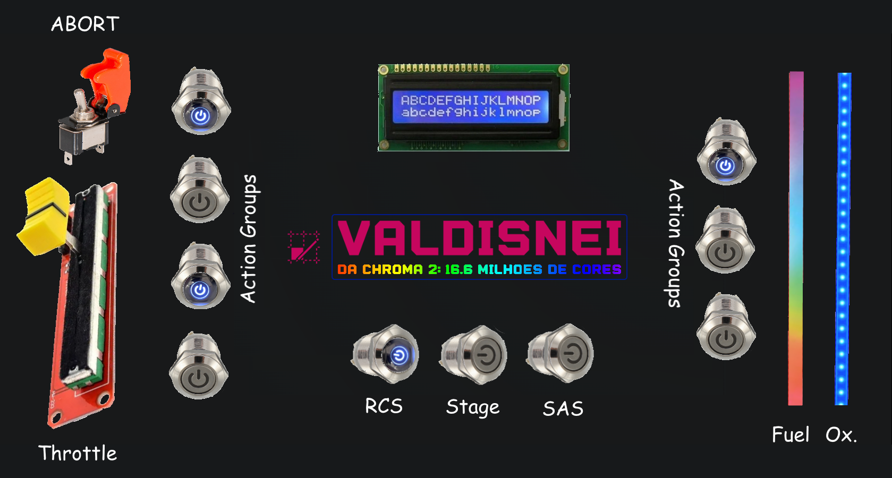

# Projeto Embarcados

Desenvolvendo um controle remoto Bluetooth.

### Integrantes

- Ariel Leventhal
- Rafael Katri
- Felipe Catapano

### Ideia

A ideia do projeto é criar um controle bluetooth que simula um mission controller realista para o jogo Kerbal Space Program, assim aumentando a imersão do jogo e providenciando feedback visual diretamente no controle.
Com isso, os jogadores podem ter uma experiência mais envolvente e realista, sentindo-se como se estivessem realmente no comando de uma missão espacial.

### O Que é o Kerbal Space Program?

Kerbal Space Program é um jogo de simulação espacial desenvolvido pela Squad e lançado em 2011. Nele, o jogador assume o papel de administrador de uma agência espacial fictícia e deve construir e gerenciar naves espaciais, realizar missões de exploração e pesquisa em um sistema solar simulado.

O jogo possui um alto grau de realismo, com física e mecânica orbital precisas, o que significa que o jogador deve levar em conta fatores como a gravidade, a atmosfera, o peso e o empuxo ao projetar e lançar suas naves. Além disso, os kerbals, criaturas humanoides verdes que habitam o jogo, são os tripulantes dessas naves e também possuem suas próprias habilidades e limitações.

Kerbal Space Program é um jogo desafiador e educativo, que exige planejamento cuidadoso e pensamento crítico para alcançar objetivos no espaço. Ele também se tornou um fenômeno na comunidade de jogos e exploração espacial, com muitos jogadores construindo e compartilhando suas próprias criações e mods para o jogo.

### Nome
Valdisnei da Chroma 2:
16.6 milhões de cores

### Usuários 

Jogadores de Kerbal Space Program e admiradores do valdisnei.

### Software/Jogo 

Kerbal space  program (KSP), utilizando mod kRPC
### Jornada do usuários
Jornada 1:

&nbsp;&nbsp;&nbsp;&nbsp;&nbsp;&nbsp;O usuário entra no jogo Kerbal Space e ativa o mod de comunicação com o controle.  Em seguida, ele inicia a gameplay usando o slider de throttle (potenciometro linear) e aperta botão de estagio para acionar os motores da nave. Antes de entrar em órbita, o usuário vê pela resposta visual dos botões de Action Group que o combustível está acabando. 
        Ele usa a chave alavanca de Abort para iniciar o protocolo de emergência que ejeta a capsula do piloto e arma o paraquedas para ser aberto automaticamente quando a velocidade e altitude forem adequadas.

Jornada 2:

&nbsp;&nbsp;&nbsp;&nbsp;&nbsp;&nbsp;O usuário entra no jogo Kerbal Space e ativa o mod de comunicação com o controle. Em seguida, ele inicia a gameplay usando o slider de throttle (potenciometro linear) e aperta botão de estagio para acionar os motores da nave. Através das leds o jogador ve que o combustivel do primeiro estagio acabou entao ele aperta botao stage para fazer separacao de estagio. Em seguida o combustivel do segundo estagio acaba tambem (essa e uma missao sub-orbital). Entao o jogador aperta o botao estagio novamente para ejetar o motor, e ativa o action group de paraquedas.
        

### Comandos/ Feedbacks

#### Comandos
* Throttle 
* Abort
* Actions groups (paraquedas, trem de pouso, freio, etc); por volta de 7.
* Proximo estagio
* Controle de estabilidade automatico
* Controle de reacao

#### Feeback

* Estado dos Actions groups (paraquedas, trem de pouso, freio, etc); por volta de 7
* Estado da missao
* Estado Controle de estabilidade automatico
* Estado Controle de reacao
* Niveis de combustivel e Agente Oxidante

## In/OUT
#### IN
* Throttle: Potenciometro Linear
* Abort: Chave alanvaca
* Actions groups (paraquedas, trem de pouso, freio, etc); por volta de 7: Push button Retroiluminado.
* Proximo estagio: Push button retro iluminado
* Controle de estabilidade automatico: Chave alavanca para ativar e  Push button RGB para ciclar modos
* Controle de reacao: push button retroiluminado

#### Out

* Estado dos Actions groups (paraquedas, trem de pouso, freio, etc); por volta de 7: Led dos botoes
* Estado da missao: led do botao de estagio
* Estado Controle de estabilidade automatico: Cor da led do botao
* Estado Controle de reacao: Led do botao
* Niveis de combustivel e Agente Oxidante: Segmento de fita led RGB.
### Design

O design do controle foi inspirado nas seguintes criações da comunidade de KSP:

O nosso design segue esse layout:

